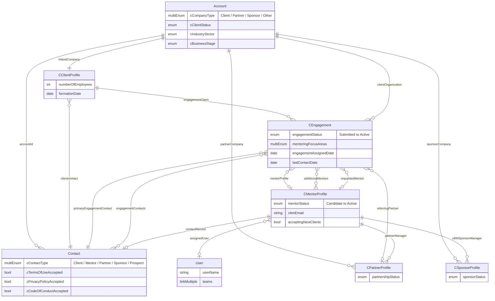
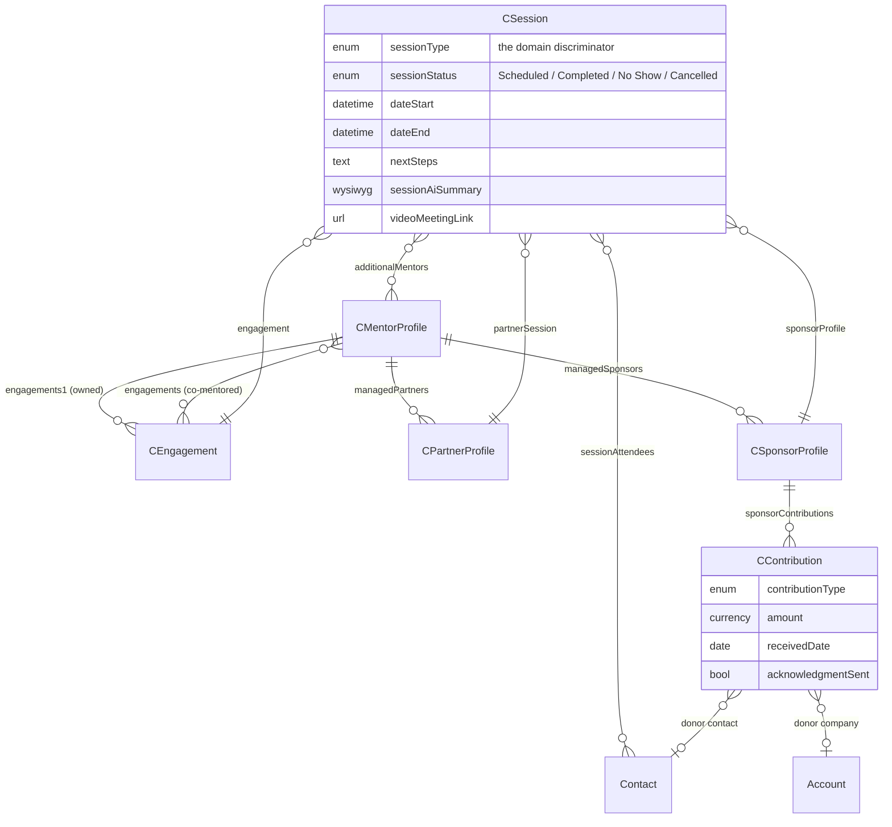
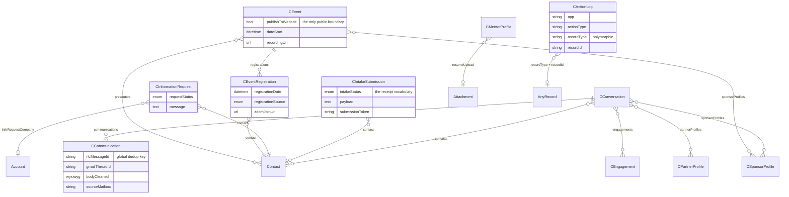

# Data model — entity-relationship reference

How the data is structured across the two stores this platform uses. Drawn from
the code (`core/store.py`, `core/schema_contract.py`, `sessions/config.py`, the
five `forms/*/orchestrator.py` modules) and the CRM build handoffs, not from
prose. Cardinality reflects the CRM as of 2026-08-20.

Published as a browsable page: <https://claude.ai/code/artifact/43f7db62-7c3f-49cb-b2da-b0aba1c5ade6>

## The two stores

**EspoCRM is the system of record** for every person, company and relationship,
and it also enforces every permission — the app reads and writes as the
signed-in user. **Postgres holds what the CRM cannot**: durable capture, retry
state, staff collaboration and cached analytics.

```
Browser  ──captured first──▶  Postgres  ──delivery-worker──▶  EspoCRM
5 forms   (before any CRM      submission   (retries,          Account, Contact,
11 tools   call)               app_document  resumable)        CEngagement, …
                               record_comment
                                  ╎
                                  ╰── (entity_type, record_id) — soft key, no FK
```

Two properties follow. A submission is durable before the CRM is ever contacted,
so a CRM outage costs nothing. And app rows name CRM records by type + id rather
than a foreign key, so the two databases are backed up, restored and reasoned
about separately — drop Postgres entirely and the app falls back to V1 behaviour.

## The client spine

Two native entities — `Account` (presented in the CRM as **Company**) and
`Contact` — plus three custom hubs that say what kind of relationship CBM has.
A `CEngagement` is one mentoring request; a client can have many over time, all
hanging off one `CClientProfile`.



A mentor is a `Contact` **plus** a `CMentorProfile` **plus** — once approved — a
CRM `User` to sign in with. That chain is why a mentor whose profile is not
assigned to their User is invisible in the session tools: the app resolves "me"
by walking `User → assignedUser → CMentorProfile`, then the reverse links out to
the records they manage.

**Discriminators.** Company type is `cCompanyType`, never `cAccountType` (gone
from both CRMs), and the sponsor value is `"Sponsor"`, not `"Donor/Sponsor"`.
Both it and `Contact.cContactType` are multi-enums, and EspoCRM rejects an
invalid multi-enum outright — the create 400s and nothing is written.

## One session entity, three parents

Client Management, Partner Management and Funder Management look like three
applications and are one. They write the same `CSession`; only the parent link
differs, with a `sessionType` discriminator riding along.



The manager's three reverse links — `engagements1`, `managedPartners`,
`managedSponsors` — are the whole ownership model, and re-pointing the belongsTo
behind one of them (`partnerManager`, `cBMSponsorManager`) is how a record
changes hands.

**`sessionAttendees` and `additionalMentors` are relationships, not fields.**
Reading `<field>Ids` returns empty and setting it on an update is silently
ignored; they are read with `list_related` and written with relate / unrelate,
which EspoCRM permission-checks on *both* sides.

## What attaches to a record

Email, receipts, enquiries, events and the audit trail hang off the spine rather
than sitting inside it.



`CIntakeSubmission` is one row per arrival of any kind, updated in place through
a six-word status vocabulary — the CRM-side mirror of the `submission` table
below, joined by `crm_receipt_id`.

`CEvent` doubles as CBM's internal org calendar; `publishToWebsite` (default
false) is the entire boundary to the public site.

## The app database

Eighteen tables under Alembic (`0001`–`0026`), in five groups. Only the
submission cluster has real foreign keys; everything else points into the CRM by
soft key.

```mermaid
erDiagram
    submission {
        string id PK
        string form_slug UK "uq_submission_form_token"
        string submission_token UK
        jsonb payload
        string status "pending / processing / needs_attention"
        jsonb progress "makes delivery resumable"
        jsonb result "the created CRM ids"
        jsonb thread_ids "anchored Gmail threads"
        string crm_receipt_id FK
        string duplicate_of FK
        timestamptz next_attempt_at
        timestamptz locked_until "worker lease"
    }
    submission_comment {
        string id PK
        string submission_id FK
        string author
        text body
    }
    submission_activity {
        string id PK
        string submission_id FK
        string kind
        string actor
    }
    submission_presence {
        string submission_id PK
        string user_name PK
        timestamptz viewed_at
    }
    app_document {
        string id PK
        string drive_file_id UK
        string entity_type "soft key"
        string record_id "soft key"
        string content_sha256 "per-record dedup"
        string status "active / archived"
    }
    record_comment {
        string id PK
        string parent_type "soft key"
        string parent_id "soft key"
        text body
    }
    comm_attachment {
        string rfc_message_id PK
        int part_index PK
        string entity_type PK
        string record_id PK
        string document_id FK
        string status "filed / duplicate / failed"
    }
    conversation_thread {
        string mailbox PK
        string thread_id PK
        string conversation_id
    }
    conversation_seen {
        string username PK
        string conversation_id PK
    }
    conversation_override {
        string parent_entity PK
        string parent_id PK
        string conversation_id PK
        string action "include / exclude"
    }
    analytics_metric {
        string id PK
        string key UK
        string entity
        text definition "filters + aggregation"
    }
    analytics_page {
        string id PK
        string key UK
        string scope "one dashboard per record type"
        text panels "JSON, references metric keys"
    }

    submission            ||--o{ submission_comment  : "submission_id"
    submission            ||--o{ submission_activity : "submission_id"
    submission            ||--o{ submission_presence : "submission_id"
    submission            |o--o| submission          : "duplicate_of"
    submission            }o--o| CIntakeSubmission   : "crm_receipt_id"
    app_document          }o--|| CRM_Record          : "entity_type + record_id"
    record_comment        }o--|| CRM_Record          : "parent_type + parent_id"
    comm_attachment       }o--o| app_document        : "document_id"
    comm_attachment       }o--|| CRM_Record          : "entity_type + record_id"
    conversation_thread   }o--|| CConversation       : "conversation_id"
    conversation_seen     }o--|| CConversation       : "conversation_id"
    conversation_override }o--|| CConversation       : "conversation_id"
    analytics_page        }o--o{ analytics_metric    : "panels[].metric_key"
```



`(form_slug, submission_token)` is the idempotency guarantee: a double-submitted
form cannot produce two rows. And because the worker records each CRM create in
`progress`, a retry resumes a half-finished chain instead of duplicating it.

| Table | Group | Holds | Key |
|---|---|---|---|
| `submission` | Capture | Every arrival, its payload, delivery state and staff resolution | id + (form_slug, submission_token) |
| `submission_comment` | Capture | Attributed, append-only admin discussion | id |
| `submission_activity` | Capture | Automatic event feed, system and staff | id |
| `submission_presence` | Capture | "Viewed 4 min ago" — the anti-double-reply cue | (submission_id, user_name) |
| `record_comment` | Capture | Staff-internal comments on any CRM record; never mirrored to the CRM | id |
| `email_sync_state` | Email | Per-mailbox Gmail cursor, failures and dead letters | mailbox |
| `conversation_thread` | Email | Gmail thread → CConversation map; makes empty shells findable | (mailbox, thread_id) |
| `conversation_override` | Email | Manual include / exclude of a thread on a record | (parent_entity, parent_id, conversation_id) |
| `conversation_seen` | Email | Per-user read state, which drives unread | (username, conversation_id) |
| `comm_attachment` | Email | Filing ledger and retry queue for inbound attachments | (rfc_message_id, part_index, entity_type, record_id) |
| `app_document` | Documents | The Drive index: one row per filed document | id, unique drive_file_id |
| `analytics_cache` | Analytics | Cached panel results with expiry | (metric_key, context_key, range_key) |
| `analytics_metric` | Analytics | Admin-authored metric definitions | id, unique key |
| `analytics_page` | Analytics | Composed pages; panels stored inline as JSON | id, unique key |
| `app_setting` | Config | Runtime overrides on top of the env baseline | key |
| `app_setting_history` | Config | Who changed which setting, when and why | id |
| `app_config` | Config | Encrypted config blobs (Google Workspace credentials) | key |
| `app_job` | Config | Dry-run / apply operations jobs and their plan fingerprints | id |
| `worker_heartbeat` | Config | One row; the worker's liveness beat, reported on `/healthz` | id |

## What each public form creates

The orchestrator module for each form is the source-of-truth mapping.

| Form | Records created, in order | Repeat submission |
|---|---|---|
| **client-intake** | Account → Contact → CClientProfile → CEngagement | Profile matched on `linkedCompanyId`; a returning client gets a new engagement on the existing hub |
| **volunteer** | Contact (`cContactType=Mentor`) → CMentorProfile, optional résumé Attachment | Contact reused, empty fields back-filled only |
| **info-request** | Contact (Prospect) + Account when a company is named → CInformationRequest | Appends to the existing contact's description |
| **partner** | Account (`cCompanyType=Partner`) → Contact → CPartnerProfile (Candidate) | Company and contact reused; the type value is merged in, never overwritten |
| **sponsor** | Account (`cCompanyType=Sponsor`) → Contact → CSponsorProfile | Same merge-only reuse |

Two more submission kinds never come from a wizard: **info-email** (a thread
captured from the shared inbox, held for triage) and **event-registration**
(Contact → CEventRegistration → a Zoom registrant). Both still get a `submission`
row and a `CIntakeSubmission` receipt.

## Cardinality rulings

Three links look inconsistent and are not.

| Link | Cardinality | Why |
|---|---|---|
| `CClientProfile.linkedCompany` | **one-to-one** | A client never has two client business profiles (Doug, 2026-08-16). Correct as it stands — do not "fix" it to match the other two. The guard lives in the app: the profile is find-or-created on `linkedCompanyId`, because an unconditional create moved the Account and contact off the existing hub twice in production. |
| `CPartnerProfile.partnerCompany` | **many-to-one** | A partnership is with a programme inside an organisation as often as with the organisation itself. Was one-to-one until 2026-08-14, which is how a live partner record lost its company to a duplicate entered nine hours later. |
| `CSponsorProfile.sponsorCompany` | **many-to-one** | Funders followed partners 2026-08-16, proven with a two-funders-one-company test. |

Other structural traps, all detailed in `CLAUDE.md` § *Gotchas*:

- **Foreign fields are read-only mirrors** — a field that displays a linked
  record's value but refuses to save is usually `type: foreign`, not a bug.
- **Assigned users, not assigned user** — all five assigned entities use
  Multiple Assigned Users, which *disables* the single `assignedUser`: reads
  return null, hiding previously stored values, and writes are silently ignored.
- **Removing a relationship is metadata-only** — the column and its data
  survive, so a same-named recreate re-adopts them; a mis-named recreate strands
  the data and reads exactly like data loss.
- **A list page over 200 rows is a 403, not a truncation** — inside a
  best-effort handler that reads as "no records".
